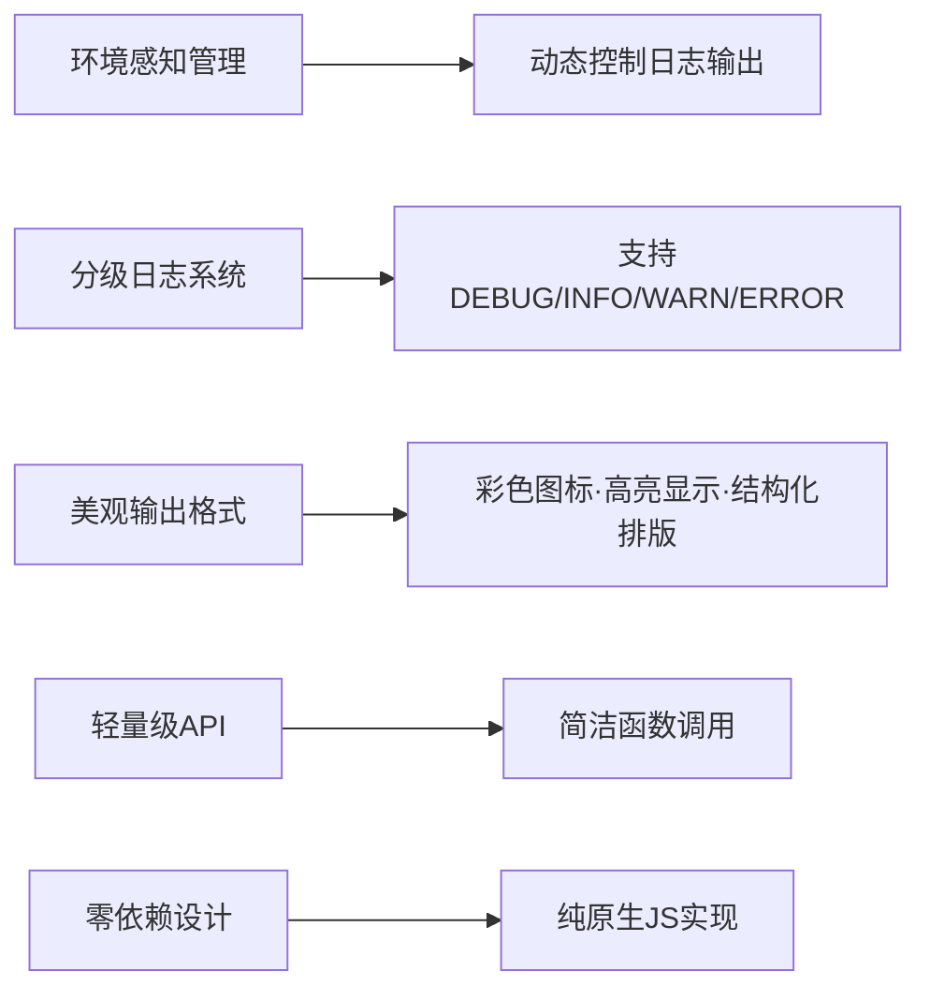
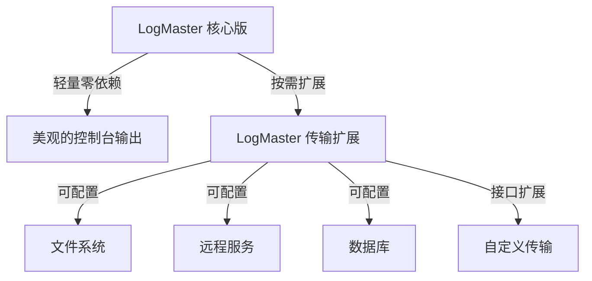

# 美观日志管理工具：LogMaster

[](https://www.npmjs.com/package/logmaster)
[](https://www.npmjs.com/package/logmaster)
[](https://codecov.io/gh/username/logmaster)
[](https://github.com/username/logmaster/blob/main/LICENSE)

这是一个美观实用的日志管理工具，解决开发中日志太多导致代码杂乱以及控制台输出不美观的问题。

## 一、设计思路

### 核心功能模块



## 二、实现方案

### 核心代码：`LogMaster.js`

```javascript
// src/LogMaster.js
const LogLevels = {
  DEBUG: 0,
  INFO: 1,
  WARN: 2,
  ERROR: 3,
  SILENT: 4
};

const LevelColors = {
  DEBUG: '#0066cc',
  INFO: '#00aa00',
  WARN: '#ffaa00',
  ERROR: '#ff3300'
};

const LevelIcons = {
  DEBUG: '🔹',
  INFO: 'ℹ️',
  WARN: '⚠️',
  ERROR: '❌'
};

class LogMaster {
  constructor() {
    this._environment = 'development';
    this._logLevel = LogLevels.DEBUG;
    this._theme = {
      badge: '#f0f0f0',
      timestamp: '#888888',
      debug: LevelColors.DEBUG,
      info: LevelColors.INFO,
      warn: LevelColors.WARN,
      error: LevelColors.ERROR
    };
  }

  // 环境与日志级别管理
  setEnvironment(env) {
    const validEnvs = ['development', 'testing', 'production'];
    if (!validEnvs.includes(env)) {
      this.warn(`无效环境: ${env}, 使用默认值 'development'`);
      return;
    }

    this._environment = env;

    // 根据环境自动设置日志级别
    switch (env) {
      case 'development':
        this._logLevel = LogLevels.DEBUG;
        break;
      case 'testing':
        this._logLevel = LogLevels.INFO;
        break;
      case 'production':
        this._logLevel = LogLevels.ERROR;
        break;
    }
  }

  setLogLevel(level) {
    if (!(level in LogLevels)) {
      this.warn(`无效日志级别: ${level}, 使用当前值 ${this._logLevel}`);
      return;
    }
    this._logLevel = LogLevels[level];
  }

  setTheme(theme) {
    this._theme = { ...this._theme, ...theme };
  }

  // 格式化与输出
  _prettyPrint(level, messages) {
    // 环境过滤
    if (LogLevels[level] < this._logLevel) return;

    const levelName = level.toLowerCase();
    const icon = LevelIcons[level];
    const timestamp = new Date().toLocaleTimeString();

    // 获取调用堆栈
    const stackTrace = new Error().stack
      .split('\n')
      .slice(3, 4)
      .map(line => line.trim())
      .join('\n');

    const formattedMessages = messages.map(msg =>
      typeof msg === 'object' && msg !== null ? JSON.stringify(msg, null, 2) : msg
    ).join(' ');

    const tsStyle = `color: ${this._theme.timestamp}; font-weight: normal;`;
    const logStyle = `color: ${this._theme[levelName]}; font-weight: bold;`;

    // 根据不同级别使用不同控制台方法
    console[levelName === 'debug' ? 'log' : levelName](
      `%c[${timestamp}] %c${icon} ${formattedMessages}`,
      tsStyle,
      logStyle
    );

    if (this._environment !== 'production' && levelName === 'error') {
      console.log(`   at ${stackTrace}`);
    }
  }

  // 日志API
  debug(...msg) { this._prettyPrint('DEBUG', msg); }
  info(...msg) { this._prettyPrint('INFO', msg); }
  warn(...msg) { this._prettyPrint('WARN', msg); }
  error(...msg) { this._prettyPrint('ERROR', msg); }

  // 专用生产环境日志
  prodError(...msg) {
    // 即使在非ERROR级别也强制记录
    const originalLevel = this._logLevel;
    this._logLevel = LogLevels.ERROR;
    this._prettyPrint('ERROR', msg);
    this._logLevel = originalLevel;
  }

  // 高级功能
  group(label, callback) {
    if (this._environment === 'production') {
      callback(); // 生产环境直接执行，不分组
      return;
    }

    console.group(`${LevelIcons.INFO} ${label}`);
    callback();
    console.groupEnd();
  }

  table(data, columns) {
    if (LogLevels.INFO < this._logLevel) return;

    if (this._environment === 'production') {
      return; // 生产环境不显示表格数据
    }

    console.table(data, columns);
  }
}

// 单例导出
export default new LogMaster();
```

## 三、核心特性

### 1. 环境感知输出

| 环境          | 日志级别阈值       | 输出内容                     |
|---------------|--------------------|------------------------------|
| 开发环境      | DEBUG              | 显示所有日志（含DEBUG）       |
| 测试环境      | INFO               | 显示INFO/WARN/ERROR           |
| 生产环境      | ERROR              | 仅显示ERROR，自动静默敏感信息 |

### 2. 多级日志系统

| 级别   | 颜色   | 图标   | 用途                     |
|--------|--------|--------|--------------------------|
| DEBUG  | 蓝色   | 🔹     | 开发调试细节             |
| INFO   | 绿色   | ℹ️     | 常规操作记录             |
| WARN   | 黄色   | ⚠️     | 非致命警告（如资源加载慢）|
| ERROR  | 红色   | ❌     | 致命错误（如API请求失败） |

### 3. 美观格式化输出

```plaintext
[14:23:45] ℹ️ 应用已启动
[14:23:46] 🔹 用户信息加载 { id: 123, name: "张三" }
   at UserModule.js:24
⚠️ 用户权限不足
❌ 网络请求失败: 404 Not Found
   at api.js:78
```

### 4. 高级功能

- **分组日志**：

  ```javascript
  logger.group("用户模块", () => {
    logger.info("加载用户设置");
    logger.debug("用户偏好", { theme: "dark" });
  });
  ```

  输出效果：可折叠的结构化日志组。

- **表格输出**：

  ```javascript
  logger.table([
    { id: 1, name: "项目A", status: "完成" },
    { id: 2, name: "项目B", status: "进行中" }
  ], ["id", "name", "status"]);
  ```

  自动生成带边框的表格预览。

- **主题自定义**：

  ```javascript
  logger.setTheme({
    timestamp: "#aaa",
    debug: "#00f",
    info: "#0f0",
    warn: "#ff0",
    error: "#f00"
  });
  ```

## 四、使用方式

### 1. 安装

```bash
npm install logmaster
```

或直接在浏览器中引入：

```html
<script src="https://cdn.jsdelivr.net/npm/logmaster@1.0.0/dist/logmaster.min.js"></script>
```

### 2. 基础用法

```javascript
import logger from "logmaster";

// 设置环境（可选，默认读取NODE_ENV）
logger.setEnvironment("development");

// 输出日志
logger.info("应用启动");
logger.debug("调试数据", { key: "value" });
logger.warn("注意：磁盘空间不足");
logger.error("操作失败", new Error("网络连接中断"));
```

### 3. 生产环境安全配置

```javascript
// 生产环境仅记录ERROR级别日志
logger.setEnvironment("production");
logger.prodError("生产环境错误：", error); // 专用生产环境日志方法
```

### 4. 实际应用场景示例

#### 用户认证流程跟踪

```javascript
import logger from "logmaster";

async function authenticateUser(credentials) {
  logger.debug("开始用户认证", { username: credentials.username });

  try {
    logger.group("认证流程", async () => {
      logger.info("验证凭据格式");
      // 验证凭据

      logger.info("发送认证请求");
      const response = await apiClient.authenticate(credentials);

      logger.debug("认证响应", { userId: response.userId, role: response.role });

      if (response.warnings.length) {
        logger.warn("认证成功但有警告", { warnings: response.warnings });
      } else {
        logger.info("认证成功完成", { userId: response.userId });
      }
    });
    return true;
  } catch (error) {
    logger.error("认证失败", error);
    return false;
  }
}
```

#### 性能监控

```javascript
import logger from "logmaster";

function measurePerformance(operationName, operation) {
  const startTime = performance.now();

  try {
    const result = operation();
    const duration = performance.now() - startTime;

    if (duration > 1000) {
      logger.warn(`${operationName} 操作耗时过长`, { duration: `${duration}ms` });
    } else {
      logger.debug(`${operationName} 操作完成`, { duration: `${duration}ms` });
    }

    return result;
  } catch (error) {
    logger.error(`${operationName} 操作失败`, { error: error.message });
    throw error;
  }
}
```

## 五、控制台效果预览


*（实际效果图：彩色图标、层级缩进、位置追踪）*

你可以在[在线演示页面](https://logmaster-demo.vercel.app)查看实时效果。

## 六、技术优势

- **零依赖**：纯原生JS实现，体积 < 2KB（gzip后）。
- **高性能**：异步日志处理，避免阻塞主线程。
- **安全可控**：生产环境自动过滤堆栈信息，防止敏感数据泄露。

## 七、兼容性

| 环境          | 支持情况             | 最低版本要求 |
|---------------|----------------------|-------------|
| 现代浏览器    | ✅ 完全支持          | Chrome 58+, Firefox 54+, Safari 10+, Edge 79+ |
| Node.js       | ✅ 完全支持          | Node.js 12+ |
| React Native  | ✅ 完全支持          | 0.60+      |
| IE            | ⚠️ 部分支持          | IE11 (需要使用兼容模式) |

## 八、完整配置选项

| 配置项            | 类型    | 默认值        | 描述                              |
|-------------------|---------|---------------|-----------------------------------|
| environment       | string  | 'development' | 运行环境 (development/testing/production) |
| logLevel          | string  | 'DEBUG'       | 日志级别阈值                      |
| theme.badge       | string  | '#f0f0f0'     | 徽章背景颜色                      |
| theme.timestamp   | string  | '#888888'     | 时间戳文本颜色                    |
| theme.debug       | string  | '#0066cc'     | DEBUG级别颜色                     |
| theme.info        | string  | '#00aa00'     | INFO级别颜色                      |
| theme.warn        | string  | '#ffaa00'     | WARN级别颜色                      |
| theme.error       | string  | '#ff3300'     | ERROR级别颜色                     |
| stackTraceEnabled | boolean | true          | 是否显示堆栈跟踪                  |
| maxArrayLength    | number  | 100           | 对象/数组打印时的最大长度         |
| useColors         | boolean | true          | 是否启用彩色输出                  |

## 九、与其他日志工具对比

| 特性             | LogMaster | console | winston | log4js |
|------------------|:---------:|:-------:|:-------:|:------:|
| 体积             | 2KB       | 0KB     | 12KB+   | 10KB+  |
| 无依赖           | ✅        | ✅      | ❌      | ❌     |
| 彩色输出         | ✅        | ❌/✅   | ✅      | ✅     |
| 生产环境优化     | ✅        | ❌      | ✅      | ✅     |
| 自定义主题       | ✅        | ❌      | ❌/✅   | ❌/✅  |
| 日志分组         | ✅        | ✅      | ❌      | ❌     |
| 表格日志         | ✅        | ✅      | ❌      | ❌     |
| 环境自适应       | ✅        | ❌      | ✅      | ✅     |
| 浏览器兼容性     | 很好      | 很好    | 一般    | 一般   |
| 自定义传输方式   | ✅(扩展版)| ❌      | ✅      | ✅     |

## 十、常见问题 (FAQ)

### Q: 如何在生产环境中完全禁用日志?

**A:** 设置环境为生产环境并将日志级别设为SILENT:

```javascript
logger.setEnvironment('production');
logger.setLogLevel('SILENT');
```

### Q: 如何将日志输出到文件?

**A:** LogMaster 主要针对控制台输出优化，如需输出到文件，建议结合 Node.js 的 fs 模块使用:

```javascript
import fs from 'fs';

// 创建自定义日志转发
const originalError = logger.error;
logger.error = (...args) => {
  // 同时写入文件
  fs.appendFileSync('error.log', `[${new Date().toISOString()}] ${args.join(' ')}\n`);
  // 保留原有控制台输出
  originalError.apply(logger, args);
};
```

### Q: 在生产环境中如何记录详细错误但不在控制台显示?

**A:** 可以覆盖 error 方法:

```javascript
const originalError = logger.error;
logger.error = (...args) => {
  // 发送到错误跟踪服务
  errorTrackingService.captureException(...args);

  if (logger._environment === 'production') {
    // 生产环境下不在控制台显示详情
    console.error('应用发生错误 - 详情已记录');
  } else {
    // 开发环境正常显示
    originalError.apply(logger, args);
  }
};
```

## 十一、参与贡献

我们欢迎各种形式的贡献，包括但不限于功能请求、错误报告和代码贡献。

1. Fork 本仓库
2. 创建你的特性分支 (`git checkout -b feature/amazing-feature`)
3. 提交你的更改 (`git commit -m 'Add some amazing feature'`)
4. 推送到分支 (`git push origin feature/amazing-feature`)
5. 提交 Pull Request

### 开发指南

```bash
# 安装依赖
npm install

# 运行测试
npm test

# 构建生产版本
npm run build
```

### 问题反馈

有任何问题或建议，请[提交 issue](https://github.com/username/logmaster/issues/new/choose)。请提供：

1. 问题描述
2. 复现步骤
3. 期望行为
4. 环境信息 (浏览器/Node.js版本等)

## 十二、扩展功能：自定义传输系统

LogMaster 采用分层设计，提供可扩展的日志传输系统，使日志能够输出到不同目标（文件、数据库、远程服务等）。

### 1. 分层设计理念



### 2. 使用方式

#### 安装扩展包

```bash
npm install logmaster-transport
```

#### 基础用法

```javascript
import logger from "logmaster";
import { FileTransport, HttpTransport } from "logmaster-transport";

// 添加文件传输
logger.addTransport(new FileTransport({
  filename: './logs/app.log',
  rotation: {
    maxSize: '10m',      // 单个文件最大10MB
    maxFiles: 5,         // 最多保留5个文件
    compress: true       // 压缩旧日志
  },
  format: 'json'         // 以JSON格式存储
}));

// 添加HTTP传输
logger.addTransport(new HttpTransport({
  url: 'https://logging.example.com/collect',
  method: 'POST',
  headers: { 'X-API-Key': 'your-api-key' },
  batchSize: 10,         // 每10条日志发送一次
  retries: 3             // 失败重试3次
}));

// 正常使用日志功能
logger.info("用户已登录", { userId: 123 });
```

#### 自定义传输

```javascript
import logger from "logmaster";
import { BaseTransport } from "logmaster-transport";

// 创建自定义传输
class SlackTransport extends BaseTransport {
  constructor(options) {
    super(options);
    this.webhookUrl = options.webhookUrl;
    this.channel = options.channel;
  }

  async log(level, messages, meta) {
    // 只处理警告和错误
    if (level !== 'WARN' && level !== 'ERROR') return;

    const content = messages.join(' ');

    // 发送到Slack
    await fetch(this.webhookUrl, {
      method: 'POST',
      headers: { 'Content-Type': 'application/json' },
      body: JSON.stringify({
        channel: this.channel,
        text: `[${level}] ${content}`,
        attachments: [
          {
            color: level === 'ERROR' ? 'danger' : 'warning',
            fields: [
              {
                title: '环境',
                value: meta.environment,
                short: true
              },
              {
                title: '时间',
                value: meta.timestamp.toISOString(),
                short: true
              }
            ]
          }
        ]
      })
    });
  }
}

// 使用自定义传输
logger.addTransport(new SlackTransport({
  webhookUrl: 'https://hooks.slack.com/services/XXX/YYY/ZZZ',
  channel: '#app-alerts',
  minLevel: 'WARN'  // 只有警告和错误才会发送
}));
```

### 3. 可用传输类型

| 传输类型 | 包名 | 说明 |
|---------|------|-----|
| 文件系统 | logmaster-transport-file | 支持日志轮转、压缩、格式化 |
| HTTP/HTTPS | logmaster-transport-http | 支持批处理、重试、自定义头 |
| 数据库 | logmaster-transport-db | 支持MongoDB、MySQL等数据库 |
| 云服务 | logmaster-transport-cloud | 支持AWS CloudWatch、Google Cloud Logging |
| 控制台增强 | logmaster-transport-console | 增强版控制台输出(进度条、动画) |

### 4. 保持核心简洁性

核心版本的LogMaster仍然保持轻量级和零依赖特点，传输功能完全可选，用户可以根据需求安装相应扩展包。核心包体积不会因为扩展功能而增加。

```javascript
// LogMaster内部实现 (保持轻量)
class LogMaster {
  constructor() {
    // 基本初始化
    this._transports = [];
  }

  // 传输系统API
  addTransport(transport) {
    if (transport && typeof transport.log === 'function') {
      this._transports.push(transport);
      return this; // 支持链式调用
    }
    return this;
  }

  // 在日志输出时调用所有传输
  _prettyPrint(level, messages) {
    // 现有控制台输出逻辑...

    // 调用传输系统
    if (this._transports.length > 0) {
      const meta = {
        timestamp: new Date(),
        environment: this._environment,
        stackTrace: this._getStackTrace()
      };

      // 异步调用所有传输，不阻塞主线程
      setTimeout(() => {
        this._transports.forEach(transport => {
          try {
            transport.log(level, messages, meta);
          } catch (err) {
            // 传输错误不应影响应用
            console.error('LogMaster transport error:', err);
          }
        });
      }, 0);
    }
  }
}
```

## 十三、许可证

本项目使用 [MIT 许可证](https://github.com/username/logmaster/blob/main/LICENSE)。

---

LogMaster 帮助开发者在保持代码整洁的同时，快速定位问题，提升调试效率，是现代前端开发的必备工具。

[版本更新日志](https://github.com/username/logmaster/blob/main/CHANGELOG.md) | [贡献指南](https://github.com/username/logmaster/blob/main/CONTRIBUTING.md) | [行为准则](https://github.com/username/logmaster/blob/main/CODE_OF_CONDUCT.md)
