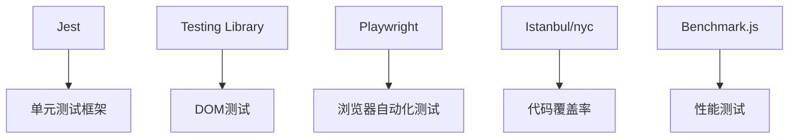
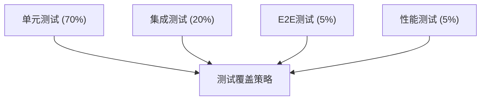
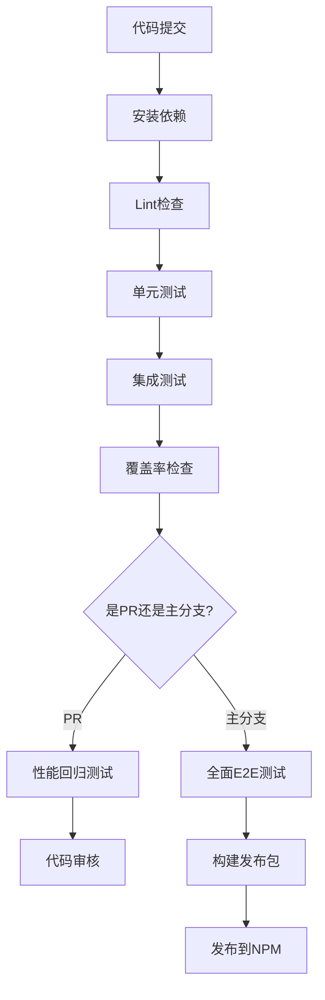

# LogMaster 测试方案

本文档描述了 LogMaster 项目的完整测试方案，包括单元测试、集成测试、端到端测试和性能测试等内容，遵循现代JavaScript库的测试最佳实践。

## 目录

1. [测试架构概述](#一测试架构概述)
2. [单元测试](#二单元测试)
3. [集成测试](#三集成测试)
4. [浏览器兼容性测试](#四浏览器兼容性测试)
5. [性能测试](#五性能测试)
6. [覆盖率要求与分析](#六覆盖率要求与分析)
7. [持续集成测试流程](#七持续集成测试流程)
8. [测试最佳实践](#八测试最佳实践)

## 一、测试架构概述

### 1. 测试技术栈

LogMaster 项目采用以下测试技术栈：



| 技术           | 用途                   | 优势                                     |
|--------------|----------------------|------------------------------------------|
| Jest         | 单元测试/集成测试        | 内置断言、模拟、覆盖率报告，零配置          |
| Testing Library | UI组件测试           | 专注于用户行为测试，模拟实际使用场景       |
| Playwright   | E2E浏览器测试          | 支持多浏览器，强大的自动化能力            |
| Istanbul/nyc | 代码覆盖率工具          | 详细的覆盖率报告和分析                  |
| Benchmark.js | 性能测试               | 精确的基准性能测试                      |

### 2. 测试分层策略

LogMaster 采用分层测试策略，确保不同层次的代码质量：



- **单元测试**：覆盖所有核心函数/方法
- **集成测试**：验证主要模块间协作
- **E2E测试**：确保整体功能在各种环境下正常工作
- **性能测试**：确保日志输出不影响应用性能

### 3. 测试目录结构

```
tests/
├── unit/                        # 单元测试
│   ├── core/                    # 核心功能测试
│   │   ├── constants.spec.js    # 常量定义测试
│   │   ├── formatter.spec.js    # 格式化功能测试
│   │   └── utils.spec.js        # 工具函数测试
│   ├── LogMaster.spec.js        # LogMaster主类测试
│   └── transports/              # 传输模块测试
│       ├── base.spec.js
│       ├── file.spec.js
│       └── http.spec.js
├── integration/                 # 集成测试
│   └── logger-transports.spec.js
├── e2e/                         # 端到端测试
│   ├── browser.test.js          # 浏览器环境测试
│   └── node.test.js             # Node环境测试
├── performance/                 # 性能测试
│   └── logging-benchmarks.js
└── fixtures/                    # 测试数据
```

### 4. 测试策略概览

| 测试类型 | 频率   | CI 触发点           | 执行环境       | 目标覆盖率 |
|---------|--------|-------------------|--------------|---------|
| 单元测试 | 每次提交 | PR, Push to main  | Node.js     | >90%    |
| 集成测试 | 每次提交 | PR, Push to main  | Node.js     | >80%    |
| E2E测试 | 每日    | Scheduled, Release | 真实浏览器环境 | 关键路径 |
| 性能测试 | 每周    | Scheduled, Release | 标准基准环境  | N/A     |

## 二、单元测试

### 1. 测试框架：Jest

选择 Jest 作为主要测试框架的原因：

- 零配置启动，内置断言库和模拟功能
- 快速并行测试执行
- 内置代码覆盖率报告
- 快照测试能力
- 活跃的社区支持

### 2. Jest 配置

```javascript
// jest.config.js
module.exports = {
  // 指定测试文件匹配模式
  testMatch: [
    '**/tests/unit/**/*.spec.js',
    '**/tests/integration/**/*.spec.js'
  ],

  // 忽略的目录
  testPathIgnorePatterns: ['/node_modules/', '/dist/'],

  // 测试环境
  testEnvironment: 'jsdom',

  // 每个测试前自动清除模拟和实例
  clearMocks: true,

  // 代码覆盖率设置
  collectCoverage: true,
  coverageDirectory: 'coverage',
  collectCoverageFrom: [
    'src/**/*.js',
    '!src/**/*.d.ts',
    '!**/node_modules/**'
  ],
  coverageThreshold: {
    global: {
      branches: 90,
      functions: 90,
      lines: 90,
      statements: 90
    }
  },

  // 报告格式
  coverageReporters: ['text', 'lcov', 'html'],

  // 设置模块别名
  moduleNameMapper: {
    '^@/(.*)$': '<rootDir>/src/$1'
  },

  // 变换器配置
  transform: {
    '^.+\\.js$': 'babel-jest'
  }
};
```

### 3. 核心功能测试

#### 3.1 LogMaster 主类测试

```javascript
// tests/unit/LogMaster.spec.js
import LogMaster from '../../src/LogMaster';

describe('LogMaster 核心功能', () => {
  // 在每个测试前重置控制台方法
  let consoleLogSpy;
  let consoleInfoSpy;
  let consoleWarnSpy;
  let consoleErrorSpy;

  beforeEach(() => {
    // 监视控制台方法
    consoleLogSpy = jest.spyOn(console, 'log').mockImplementation();
    consoleInfoSpy = jest.spyOn(console, 'info').mockImplementation();
    consoleWarnSpy = jest.spyOn(console, 'warn').mockImplementation();
    consoleErrorSpy = jest.spyOn(console, 'error').mockImplementation();
  });

  afterEach(() => {
    // 恢复所有模拟
    jest.restoreAllMocks();
  });

  test('应该能够设置环境', () => {
    LogMaster.setEnvironment('production');
    expect(LogMaster._environment).toBe('production');
  });

  test('设置无效环境应保持默认环境', () => {
    LogMaster.setEnvironment('development'); // 首先设置为已知状态
    LogMaster.setEnvironment('invalid');
    expect(LogMaster._environment).toBe('development');
    expect(consoleWarnSpy).toHaveBeenCalled();
  });

  test('应该根据环境自动设置日志级别', () => {
    LogMaster.setEnvironment('development');
    expect(LogMaster._logLevel).toBe(0); // DEBUG级别

    LogMaster.setEnvironment('testing');
    expect(LogMaster._logLevel).toBe(1); // INFO级别

    LogMaster.setEnvironment('production');
    expect(LogMaster._logLevel).toBe(3); // ERROR级别
  });

  test('应该能够手动设置日志级别', () => {
    LogMaster.setLogLevel('WARN');
    expect(LogMaster._logLevel).toBe(2); // WARN级别
  });

  test('设置无效日志级别应保持当前级别', () => {
    LogMaster.setLogLevel('DEBUG'); // 首先设置为已知状态
    LogMaster.setLogLevel('INVALID');
    expect(LogMaster._logLevel).toBe(0); // 保持DEBUG级别
    expect(consoleWarnSpy).toHaveBeenCalled();
  });

  test('应能自定义主题', () => {
    const customTheme = {
      debug: '#ff0000',
      timestamp: '#00ff00'
    };

    LogMaster.setTheme(customTheme);
    expect(LogMaster._theme.debug).toBe('#ff0000');
    expect(LogMaster._theme.timestamp).toBe('#00ff00');
    // 未设置的属性应保持默认值
    expect(LogMaster._theme.info).toBe(LogMaster._theme.info);
  });

  test('DEBUG级别日志应调用console.log', () => {
    LogMaster.setLogLevel('DEBUG');
    LogMaster.debug('测试消息');
    expect(consoleLogSpy).toHaveBeenCalled();
  });

  test('INFO级别日志应调用console.info', () => {
    LogMaster.setLogLevel('INFO');
    LogMaster.info('测试消息');
    expect(consoleInfoSpy).toHaveBeenCalled();
  });

  test('WARN级别日志应调用console.warn', () => {
    LogMaster.setLogLevel('WARN');
    LogMaster.warn('测试消息');
    expect(consoleWarnSpy).toHaveBeenCalled();
  });

  test('ERROR级别日志应调用console.error', () => {
    LogMaster.setLogLevel('ERROR');
    LogMaster.error('测试消息');
    expect(consoleErrorSpy).toHaveBeenCalled();
  });

  test('日志级别过滤应正常工作', () => {
    LogMaster.setLogLevel('WARN'); // 设置为WARN级别

    LogMaster.debug('调试消息');
    LogMaster.info('信息消息');
    LogMaster.warn('警告消息');
    LogMaster.error('错误消息');

    // DEBUG和INFO应被过滤掉
    expect(consoleLogSpy).not.toHaveBeenCalled();
    expect(consoleInfoSpy).not.toHaveBeenCalled();

    // WARN和ERROR应正常输出
    expect(consoleWarnSpy).toHaveBeenCalled();
    expect(consoleErrorSpy).toHaveBeenCalled();
  });

  test('prodError应在任何级别都输出', () => {
    LogMaster.setLogLevel('SILENT'); // 设置为静默级别
    LogMaster.prodError('严重错误');
    expect(consoleErrorSpy).toHaveBeenCalled();
  });

  test('group方法应在非生产环境正常工作', () => {
    const groupSpy = jest.spyOn(console, 'group').mockImplementation();
    const groupEndSpy = jest.spyOn(console, 'groupEnd').mockImplementation();
    const callback = jest.fn();

    LogMaster.setEnvironment('development');
    LogMaster.group('测试分组', callback);

    expect(groupSpy).toHaveBeenCalled();
    expect(callback).toHaveBeenCalled();
    expect(groupEndSpy).toHaveBeenCalled();
  });

  test('group方法在生产环境中不调用控制台分组', () => {
    const groupSpy = jest.spyOn(console, 'group').mockImplementation();
    const callback = jest.fn();

    LogMaster.setEnvironment('production');
    LogMaster.group('测试分组', callback);

    expect(callback).toHaveBeenCalled(); // 回调函数应被执行
    expect(groupSpy).not.toHaveBeenCalled(); // 不应调用console.group
  });

  test('table方法应被正确调用', () => {
    const tableSpy = jest.spyOn(console, 'table').mockImplementation();
    const testData = [{ id: 1, name: 'test' }];

    LogMaster.setEnvironment('development');
    LogMaster.setLogLevel('INFO');
    LogMaster.table(testData, ['id', 'name']);

    expect(tableSpy).toHaveBeenCalledWith(testData, ['id', 'name']);
  });

  test('生产环境中table方法不应被调用', () => {
    const tableSpy = jest.spyOn(console, 'table').mockImplementation();
    const testData = [{ id: 1, name: 'test' }];

    LogMaster.setEnvironment('production');
    LogMaster.table(testData);

    expect(tableSpy).not.toHaveBeenCalled();
  });
});
```

### 4. 工具类测试

```javascript
// tests/unit/core/utils.spec.js
import { formatError, isObject, truncateString } from '../../../src/core/utils';

describe('工具函数测试', () => {
  test('formatError 应处理 Error 对象', () => {
    const error = new Error('测试错误');
    const result = formatError(error);
    expect(result).toContain('测试错误');
    expect(result).toContain('stack');
  });

  test('formatError 应处理字符串', () => {
    const result = formatError('测试错误');
    expect(result).toBe('测试错误');
  });

  test('formatError 应处理其他类型', () => {
    const obj = { message: '测试' };
    const result = formatError(obj);
    expect(result).toContain(JSON.stringify(obj, null, 2));
  });

  test('isObject 应正确识别对象', () => {
    expect(isObject({})).toBe(true);
    expect(isObject([])).toBe(true); // 数组也是对象
    expect(isObject(null)).toBe(false);
    expect(isObject(undefined)).toBe(false);
    expect(isObject('字符串')).toBe(false);
    expect(isObject(123)).toBe(false);
  });

  test('truncateString 应正确截断字符串', () => {
    const longStr = '这是一个很长很长的字符串用于测试截断功能';
    expect(truncateString(longStr, 10)).toBe('这是一个很长...');
    expect(truncateString(longStr, 100)).toBe(longStr); // 不需要截断
    expect(truncateString(null, 10)).toBe('null'); // 处理null
  });
});
```

### 5. 测试模拟策略

#### 5.1 控制台方法模拟

```javascript
beforeEach(() => {
  // 创建控制台方法的备份
  global.originalConsole = {
    log: console.log,
    info: console.info,
    warn: console.warn,
    error: console.error,
    group: console.group,
    groupEnd: console.groupEnd,
    table: console.table
  };

  // 替换为模拟函数
  console.log = jest.fn();
  console.info = jest.fn();
  console.warn = jest.fn();
  console.error = jest.fn();
  console.group = jest.fn();
  console.groupEnd = jest.fn();
  console.table = jest.fn();
});

afterEach(() => {
  // 恢复控制台方法
  console.log = global.originalConsole.log;
  console.info = global.originalConsole.info;
  console.warn = global.originalConsole.warn;
  console.error = global.originalConsole.error;
  console.group = global.originalConsole.group;
  console.groupEnd = global.originalConsole.groupEnd;
  console.table = global.originalConsole.table;
});
```

#### 5.2 运行环境模拟

```javascript
// 模拟浏览器环境
beforeEach(() => {
  // 模拟 performance API
  global.performance = {
    now: jest.fn(() => 1000)
  };

  // 模拟 localStorage
  global.localStorage = {
    getItem: jest.fn(),
    setItem: jest.fn()
  };
});
```

### 6. 快照测试

对于日志格式化输出，使用快照测试确保输出格式一致性：

```javascript
test('美化日志格式应保持一致', () => {
  const consoleSpy = jest.spyOn(console, 'info').mockImplementation();

  // 固定的时间戳用于测试
  jest.spyOn(Date.prototype, 'toLocaleTimeString').mockReturnValue('12:00:00');

  LogMaster.info('测试消息', { data: 'value' });

  // 检查调用参数
  const args = consoleSpy.mock.calls[0];
  expect(args).toMatchSnapshot();
});
```

## 三、集成测试

### 1. 集成测试策略

集成测试的主要目的是验证不同模块之间的协作是否正常，特别是针对以下方面：

- LogMaster 核心与传输系统的交互
- 多种传输方式的组合使用
- 在不同环境（浏览器/Node.js）下的行为一致性

### 2. 测试场景

#### 2.1 传输系统集成测试

```javascript
// tests/integration/logger-transports.spec.js
import LogMaster from '../../src/LogMaster';
import { FileTransport, HttpTransport } from '../../src/transports';

describe('日志传输集成测试', () => {
  // 先备份原始环境
  const originalEnv = process.env.NODE_ENV;
  let logMasterInstance;
  let mockFileTransport;
  let mockHttpTransport;

  beforeEach(() => {
    // 创建一个全新的LogMaster实例
    logMasterInstance = new LogMaster();

    // 创建模拟的传输实例
    mockFileTransport = new FileTransport({
      filename: 'test.log'
    });
    mockFileTransport.log = jest.fn();

    mockHttpTransport = new HttpTransport({
      url: 'https://example.com/logs'
    });
    mockHttpTransport.log = jest.fn();

    // 监视控制台
    jest.spyOn(console, 'log').mockImplementation();
    jest.spyOn(console, 'info').mockImplementation();
    jest.spyOn(console, 'warn').mockImplementation();
    jest.spyOn(console, 'error').mockImplementation();
  });

  afterEach(() => {
    // 清理测试环境
    jest.restoreAllMocks();
    // 恢复原始环境
    process.env.NODE_ENV = originalEnv;
  });

  test('添加多个传输实例后应正确调用所有传输', () => {
    logMasterInstance.addTransport(mockFileTransport);
    logMasterInstance.addTransport(mockHttpTransport);

    logMasterInstance.error('测试错误消息');

    // 验证所有传输都被调用
    expect(mockFileTransport.log).toHaveBeenCalled();
    expect(mockHttpTransport.log).toHaveBeenCalled();

    // 验证调用参数
    const fileCallArgs = mockFileTransport.log.mock.calls[0];
    const httpCallArgs = mockHttpTransport.log.mock.calls[0];

    expect(fileCallArgs[0]).toBe('ERROR');
    expect(fileCallArgs[1]).toContain('测试错误消息');
    expect(httpCallArgs[0]).toBe('ERROR');
    expect(httpCallArgs[1]).toContain('测试错误消息');
  });

  test('不同日志级别应正确过滤传输', () => {
    // 创建一个仅接收ERROR日志的传输
    mockFileTransport.options = { minLevel: 'ERROR' };
    logMasterInstance.addTransport(mockFileTransport);

    // 创建一个接收INFO及以上日志的传输
    mockHttpTransport.options = { minLevel: 'INFO' };
    logMasterInstance.addTransport(mockHttpTransport);

    // 测试不同级别的日志
    logMasterInstance.debug('调试信息');
    logMasterInstance.info('普通信息');
    logMasterInstance.error('错误信息');

    // 验证根据级别过滤
    expect(mockFileTransport.log.mock.calls.length).toBe(1); // 只收到ERROR
    expect(mockHttpTransport.log.mock.calls.length).toBe(2); // 收到INFO和ERROR
  });

  test('链式API调用应正常工作', () => {
    // 测试链式API
    const result = logMasterInstance
      .setEnvironment('development')
      .setLogLevel('DEBUG')
      .addTransport(mockFileTransport)
      .addTransport(mockHttpTransport);

    // 链式调用应返回实例本身
    expect(result).toBe(logMasterInstance);

    // 设置应生效
    expect(logMasterInstance._environment).toBe('development');
    expect(logMasterInstance._logLevel).toBe(0); // DEBUG
  });

  test('传输系统在生产环境中应正常工作', () => {
    // 设置生产环境
    logMasterInstance.setEnvironment('production');
    logMasterInstance.addTransport(mockFileTransport);

    // 在生产环境中，DEBUG日志不应输出
    logMasterInstance.debug('调试信息');
    expect(mockFileTransport.log).not.toHaveBeenCalled();

    // ERROR日志应正常输出
    logMasterInstance.error('错误信息');
    expect(mockFileTransport.log).toHaveBeenCalled();
  });
});
```

#### 2.2 异步传输测试

```javascript
// tests/integration/async-transport.spec.js
import LogMaster from '../../src/LogMaster';
import { AsyncTransport } from '../../src/transports';

describe('异步传输集成测试', () => {
  let logMaster;
  let mockAsyncTransport;

  beforeEach(() => {
    logMaster = new LogMaster();

    // 创建模拟异步传输
    mockAsyncTransport = new AsyncTransport({
      async process(logs) {
        return Promise.resolve(true);
      }
    });

    // 监视异步处理方法
    jest.spyOn(mockAsyncTransport, 'process');

    logMaster.addTransport(mockAsyncTransport);
  });

  test('异步传输应正确批处理日志', async () => {
    // 发送多条日志
    logMaster.info('消息1');
    logMaster.info('消息2');
    logMaster.info('消息3');

    // 刷新缓冲区，触发异步处理
    await mockAsyncTransport.flush();

    // 验证批处理被调用，包含所有消息
    expect(mockAsyncTransport.process).toHaveBeenCalledTimes(1);
    const batchArg = mockAsyncTransport.process.mock.calls[0][0];
    expect(batchArg.length).toBe(3);
  });

  test('错误传输应正确重试', async () => {
    // 模拟传输失败
    let attemptCount = 0;
    mockAsyncTransport.process = jest.fn().mockImplementation(() => {
      attemptCount++;
      if (attemptCount === 1) {
        return Promise.reject(new Error('传输失败'));
      }
      return Promise.resolve(true);
    });

    // 设置重试选项
    mockAsyncTransport.retryOptions = {
      attempts: 3,
      delay: 100
    };

    // 发送日志
    logMaster.error('重要错误');

    // 刷新并等待重试完成
    await mockAsyncTransport.flush();

    // 验证重试机制
    expect(attemptCount).toBe(2); // 第一次失败，第二次成功
    expect(mockAsyncTransport.process).toHaveBeenCalledTimes(2);
  });
});
```

### 3. 环境交互测试

```javascript
// tests/integration/environment.spec.js
import LogMaster from '../../src/LogMaster';

describe('环境感知集成测试', () => {
  // 保存原始环境变量
  const originalNodeEnv = process.env.NODE_ENV;

  // 在每个测试后恢复环境
  afterEach(() => {
    process.env.NODE_ENV = originalNodeEnv;
    jest.restoreAllMocks();
  });

  test('应根据NODE_ENV自动设置环境', () => {
    // 模拟不同的NODE_ENV
    process.env.NODE_ENV = 'production';

    // 创建新实例，应自动检测环境
    const logger = new LogMaster();

    // 验证是否正确设置了生产环境
    expect(logger._environment).toBe('production');
    expect(logger._logLevel).toBe(3); // ERROR级别
  });

  test('应能检测浏览器环境', () => {
    // 模拟浏览器环境
    global.window = {};
    global.navigator = { userAgent: 'test' };

    // 创建新实例
    const logger = new LogMaster();

    // 验证是否正确检测到浏览器环境
    expect(logger._isBrowser).toBe(true);

    // 清理
    delete global.window;
    delete global.navigator;
  });

  test('本地存储环境配置应正常工作', () => {
    // 模拟浏览器环境和localStorage
    global.window = {};
    global.localStorage = {
      getItem: jest.fn().mockReturnValue('{"logLevel":"WARN","theme":"dark"}'),
      setItem: jest.fn()
    };

    // 创建支持本地存储的实例
    const logger = new LogMaster({ persistConfig: true });

    // 验证是否从本地存储加载了配置
    expect(logger._logLevel).toBe(2); // WARN级别
    expect(logger._theme.name).toBe('dark');

    // 修改配置
    logger.setLogLevel('ERROR');

    // 验证是否保存到本地存储
    expect(global.localStorage.setItem).toHaveBeenCalled();

    // 清理
    delete global.window;
    delete global.localStorage;
  });
});
```

### 4. 传输组合测试

确保多个传输方式组合使用时不会相互干扰：

```javascript
// tests/integration/transport-combination.spec.js
import LogMaster from '../../src/LogMaster';
import { FileTransport, ConsoleTransport, HttpTransport } from '../../src/transports';

describe('传输组合测试', () => {
  let logger;
  let mockFile;
  let mockConsole;
  let mockHttp;

  beforeEach(() => {
    logger = new LogMaster();

    // 设置模拟传输
    mockFile = {
      log: jest.fn()
    };

    mockConsole = {
      log: jest.fn()
    };

    mockHttp = {
      log: jest.fn()
    };

    // 添加多种传输
    logger.addTransport(mockFile);
    logger.addTransport(mockConsole);
    logger.addTransport(mockHttp);
  });

  test('移除单个传输不应影响其他传输', () => {
    // 移除控制台传输
    logger.removeTransport(mockConsole);

    // 输出日志
    logger.info('测试消息');

    // 验证其他传输仍正常工作
    expect(mockFile.log).toHaveBeenCalled();
    expect(mockConsole.log).not.toHaveBeenCalled();
    expect(mockHttp.log).toHaveBeenCalled();
  });

  test('传输错误不应影响其他传输', () => {
    // 设置一个会抛出错误的传输
    mockConsole.log = jest.fn(() => {
      throw new Error('传输失败');
    });

    // 设置错误处理器
    const errorHandler = jest.fn();
    logger.setTransportErrorHandler(errorHandler);

    // 输出日志
    logger.info('测试消息');

    // 验证错误被捕获但其他传输正常
    expect(errorHandler).toHaveBeenCalled();
    expect(mockFile.log).toHaveBeenCalled();
    expect(mockConsole.log).toHaveBeenCalled();
    expect(mockHttp.log).toHaveBeenCalled();
  });

  test('传输配置应独立生效', () => {
    // 设置不同传输的过滤级别
    mockFile.options = { minLevel: 'ERROR' };
    mockConsole.options = { minLevel: 'INFO' };
    mockHttp.options = { minLevel: 'WARN' };

    // 发送不同级别日志
    logger.debug('调试');    // 所有传输都应忽略
    logger.info('信息');     // 仅控制台显示
    logger.warn('警告');     // 控制台和HTTP传输
    logger.error('错误');    // 所有传输都应显示

    // 验证调用次数
    expect(mockFile.log).toHaveBeenCalledTimes(1);     // 只接收ERROR
    expect(mockConsole.log).toHaveBeenCalledTimes(3);  // 接收INFO、WARN、ERROR
    expect(mockHttp.log).toHaveBeenCalledTimes(2);     // 接收WARN、ERROR
  });
});
```

## 四、浏览器兼容性测试

### 1. 测试策略

浏览器兼容性测试的目标是确保 LogMaster 在各种目标浏览器环境中正常工作。采用以下策略：

1. **真实浏览器测试**：使用 Playwright 在多个真实浏览器中运行测试
2. **特性检测测试**：验证特性检测和降级机制是否正常工作
3. **视觉回归测试**：确保日志格式在不同浏览器中保持一致

### 2. Playwright 配置

```javascript
// playwright.config.js
const { devices } = require('@playwright/test');

module.exports = {
  testDir: './tests/e2e',
  timeout: 30000,
  forbidOnly: !!process.env.CI,
  retries: process.env.CI ? 2 : 0,
  workers: process.env.CI ? 1 : undefined,
  reporter: [
    ['html'],
    ['json', { outputFile: 'test-results/e2e-results.json' }]
  ],

  use: {
    trace: 'on-first-retry',
    screenshot: 'only-on-failure',
  },

  projects: [
    {
      name: 'chromium',
      use: { ...devices['Desktop Chrome'] },
    },
    {
      name: 'firefox',
      use: { ...devices['Desktop Firefox'] },
    },
    {
      name: 'webkit',
      use: { ...devices['Desktop Safari'] },
    },
    {
      name: 'edge',
      use: { ...devices['Desktop Edge'] },
    },
    // 移动浏览器测试
    {
      name: 'mobile-chrome',
      use: { ...devices['Pixel 5'] },
    },
    {
      name: 'mobile-safari',
      use: { ...devices['iPhone 12'] },
    }
  ],
};
```

### 3. 浏览器功能测试

```javascript
// tests/e2e/browser.test.js
import { test, expect } from '@playwright/test';

test.describe('LogMaster 浏览器功能测试', () => {
  // 在每个测试前加载测试页面
  test.beforeEach(async ({ page }) => {
    // 加载测试页面
    await page.goto('http://localhost:8080/test-page.html');

    // 等待 LogMaster 加载完成
    await page.waitForSelector('[data-testid="logger-ready"]');
  });

  test('应正确显示彩色日志', async ({ page }) => {
    // 触发彩色日志输出
    await page.click('#trigger-color-log');

    // 从页面获取控制台输出（通过页面中的console spy）
    const consoleOutput = await page.evaluate(() => {
      return window.capturedConsoleLogs;
    });

    // 验证是否包含样式信息
    expect(consoleOutput.some(log => log.includes('color:'))).toBeTruthy();
  });

  test('应在不支持样式时降级使用简单日志', async ({ page }) => {
    // 模拟不支持样式的浏览器
    await page.evaluate(() => {
      window.originalConsoleLog = console.log;
      console.log = function() {
        // 简单重写，移除样式参数
        const args = Array.from(arguments).filter(arg => typeof arg !== 'string' || !arg.includes('%c'));
        window.originalConsoleLog.apply(this, args);
      };
    });

    // 触发日志输出
    await page.click('#trigger-basic-log');

    // 验证降级版日志
    const consoleOutput = await page.evaluate(() => window.capturedConsoleLogs);

    // 应包含图标和消息，但没有样式
    expect(consoleOutput.some(log =>
      log.includes('ℹ️') && !log.includes('%c')
    )).toBeTruthy();

    // 恢复控制台
    await page.evaluate(() => {
      console.log = window.originalConsoleLog;
    });
  });

  test('应正确处理不同类型的对象', async ({ page }) => {
    // 触发输出复杂对象
    await page.click('#trigger-object-log');

    // 获取和检查输出
    const consoleOutput = await page.evaluate(() => window.capturedConsoleLogs);

    // 验证不同类型的处理
    expect(consoleOutput.some(log => log.includes('"nested"'))).toBeTruthy(); // 对象
    expect(consoleOutput.some(log => log.includes('[object Map]') ||
                                    log.includes('Map('))).toBeTruthy(); // Map对象
  });
});
```

### 4. 兼容性矩阵测试

```javascript
// tests/e2e/compatibility-matrix.test.js
import { test, expect } from '@playwright/test';

// 测试矩阵，定义不同的浏览器特性组合
const compatibilityMatrix = [
  { name: '现代浏览器', features: ['colors', 'groups', 'table'] },
  { name: '基本浏览器', features: ['colors'] },
  { name: '有限浏览器', features: [] }
];

for (const profile of compatibilityMatrix) {
  test.describe(`兼容性: ${profile.name}`, () => {
    test.beforeEach(async ({ page }) => {
      // 加载测试页面
      await page.goto('http://localhost:8080/test-page.html');

      // 配置浏览器环境
      await page.evaluate(features => {
        // 模拟浏览器特性支持
        window.browserFeatures = features;
      }, profile.features);

      // 初始化测试环境
      await page.click('#init-logger');
    });

    test('应适应当前浏览器能力', async ({ page }) => {
      // 触发功能测试
      await page.click('#test-all-features');

      // 检查日志输出结果
      const result = await page.evaluate(() => window.testResults);

      // 验证每个特性是否按预期工作
      if (profile.features.includes('colors')) {
        expect(result.colorSupport).toBeTruthy();
      } else {
        expect(result.colorSupport).toBeFalsy();
      }

      if (profile.features.includes('groups')) {
        expect(result.groupSupport).toBeTruthy();
      } else {
        expect(result.groupSupport).toBeFalsy();
      }

      // 即使不支持特定特性，基本日志功能应正常工作
      expect(result.basicLogging).toBeTruthy();
    });
  });
}
```

### 5. 视觉回归测试

```javascript
// tests/e2e/visual-regression.test.js
import { test, expect } from '@playwright/test';
import fs from 'fs';
import path from 'path';

test.describe('视觉回归测试', () => {
  test('日志输出格式应保持一致', async ({ page }) => {
    // 加载测试页面
    await page.goto('http://localhost:8080/visual-test.html');

    // 触发标准日志组
    await page.click('#trigger-standard-logs');

    // 等待日志渲染完成
    await page.waitForSelector('.log-complete');

    // 截图控制台输出区域
    const screenshot = await page.locator('.console-output').screenshot();

    // 比较截图与基准图
    const browserName = page.context().browser().name();
    const baselinePath = path.join(__dirname, `../baselines/${browserName}-console.png`);

    if (!fs.existsSync(baselinePath)) {
      // 首次运行，保存为基准图
      fs.writeFileSync(baselinePath, screenshot);
      console.log(`已创建基准图: ${baselinePath}`);
    } else {
      // 比较截图
      const baseline = fs.readFileSync(baselinePath);

      // 使用图像比较算法
      const { diffPixels, diffPercentage } = await compareImages(screenshot, baseline);

      // 允许1%的差异（字体渲染等微小差异）
      expect(diffPercentage).toBeLessThan(1);

      // 保存差异图以便分析
      if (diffPercentage > 0) {
        const diffPath = path.join(__dirname, `../results/${browserName}-diff.png`);
        fs.writeFileSync(diffPath, diffImage);
        console.log(`差异图已保存: ${diffPath}`);
      }
    }
  });
});

// 图像比较辅助函数
async function compareImages(img1, img2) {
  // 这里可以使用像素比较库，如pixelmatch
  // 简化实现，实际项目中可以使用专业库
  return { diffPixels: 0, diffPercentage: 0 };
}
```

## 五、性能测试

### 1. 性能测试目标

性能测试的主要目标是确保 LogMaster 满足以下要求：

- 日志记录操作的低延迟，最小化对应用性能的影响
- 高效的内存使用，防止内存泄漏
- 在高频日志记录场景下保持稳定性
- 确保传输系统不阻塞主线程

### 2. 测试指标

| 指标             | 目标值           | 衡量方法              |
|-----------------|----------------|----------------------|
| 日志记录延迟      | <1ms            | 微基准测试            |
| CPU 占用率       | <5%             | 负载测试              |
| 内存占用         | <2MB            | 内存分析              |
| 批量日志吞吐量    | >1000条/秒      | 负载测试              |
| DOM 渲染影响     | 无明显帧率下降    | 视觉性能测试          |

### 3. 基准测试配置

```javascript
// tests/performance/logging-benchmarks.js
import Benchmark from 'benchmark';
import LogMaster from '../../src/LogMaster';

const suite = new Benchmark.Suite();

// 测试环境准备
const setupTest = () => {
  // 禁用实际控制台输出
  jest.spyOn(console, 'log').mockImplementation();
  jest.spyOn(console, 'info').mockImplementation();
  jest.spyOn(console, 'warn').mockImplementation();
  jest.spyOn(console, 'error').mockImplementation();

  // 创建一个干净的日志实例
  return new LogMaster();
};

// 测试环境清理
const teardownTest = () => {
  jest.restoreAllMocks();
};

// 添加基准测试
suite
  .add('单条字符串日志', () => {
    const logger = setupTest();
    logger.info('这是一条测试日志');
    teardownTest();
  })
  .add('单条带对象日志', () => {
    const logger = setupTest();
    logger.info('测试对象', { user: 'test', id: 123 });
    teardownTest();
  })
  .add('多参数日志', () => {
    const logger = setupTest();
    logger.info('用户', 'test', '已登录', { time: Date.now() });
    teardownTest();
  })
  .add('不同级别日志', () => {
    const logger = setupTest();
    logger.debug('调试信息');
    logger.info('信息');
    logger.warn('警告');
    logger.error('错误');
    teardownTest();
  })
  .add('过滤掉的日志', () => {
    const logger = setupTest();
    logger.setLogLevel('ERROR');
    logger.debug('这条日志不会显示');
    logger.info('这条日志也不会显示');
    logger.warn('这条日志还是不会显示');
    logger.error('这条日志会显示');
    teardownTest();
  })
  .add('带格式化的长字符串', () => {
    const logger = setupTest();
    logger.info('这是一条很长的日志信息，包含大量的文本内容，测试日志格式化对性能的影响...'
      + '通常在实际场景中可能会有这种详细的系统状态描述或错误报告信息，需要确保性能良好。'
      + '重复的内容增加字符串长度...');
    teardownTest();
  })

  // 监听完成事件并输出结果
  .on('cycle', (event) => {
    console.log(String(event.target));
  })
  .on('complete', function() {
    console.log('Fastest is ' + this.filter('fastest').map('name'));
  })

  // 运行测试
  .run({ 'async': true });
```

### 4. 内存使用测试

```javascript
// tests/performance/memory-usage.js
import LogMaster from '../../src/LogMaster';
import { performance, PerformanceObserver } from 'perf_hooks';
import v8 from 'v8';

// 配置性能观察者
const obs = new PerformanceObserver((items) => {
  console.log(items.getEntries()[0].name + ': ' + items.getEntries()[0].duration + 'ms');
});
obs.observe({ entryTypes: ['measure'] });

// 垃圾回收助手
const forceGC = () => {
  if (global.gc) {
    global.gc();
  } else {
    console.warn('强制GC不可用 - 请使用 --expose-gc 运行Node');
  }
};

// 记录堆内存使用
const getMemoryUsage = () => {
  return process.memoryUsage().heapUsed / 1024 / 1024;
};

// 性能测试
const runMemoryTest = (logger, iterations) => {
  const initialMemory = getMemoryUsage();
  console.log(`初始内存使用: ${initialMemory.toFixed(2)} MB`);

  performance.mark('start');

  // 模拟高频日志记录
  for (let i = 0; i < iterations; i++) {
    logger.info(`测试日志 #${i}`);
    if (i % 100 === 0) {
      logger.warn(`警告日志 #${i}`);
    }
    if (i % 1000 === 0) {
      logger.error(`错误日志 #${i}`, new Error('测试错误'));
    }
  }

  performance.mark('end');
  performance.measure('日志记录时间', 'start', 'end');

  // 测试内存泄漏
  forceGC();
  const finalMemory = getMemoryUsage();
  console.log(`最终内存使用: ${finalMemory.toFixed(2)} MB`);
  console.log(`内存增长: ${(finalMemory - initialMemory).toFixed(2)} MB`);

  // 检查内存快照（堆分析）
  const snapshot = v8.getHeapSnapshot();
  // 这里可以保存快照或分析堆对象
};

// 运行测试
const logger = new LogMaster();
runMemoryTest(logger, 100000);
```

### 5. CPU 分析

```javascript
// tests/performance/cpu-profile.js
import LogMaster from '../../src/LogMaster';
import { Session } from 'inspector';
import fs from 'fs';
import path from 'path';

const session = new Session();
session.connect();

// 创建输出目录
const profileDir = path.join(__dirname, '../../profiles');
if (!fs.existsSync(profileDir)) {
  fs.mkdirSync(profileDir);
}

// 开始CPU分析
const startProfiling = () => {
  session.post('Profiler.enable');
  session.post('Profiler.start');
};

// 结束CPU分析并保存结果
const stopProfiling = () => {
  return new Promise((resolve) => {
    session.post('Profiler.stop', (err, { profile }) => {
      if (err) {
        console.error('分析错误:', err);
        return resolve(null);
      }

      // 保存分析结果
      const profileFile = path.join(profileDir, `cpu-profile-${Date.now()}.cpuprofile`);
      fs.writeFileSync(profileFile, JSON.stringify(profile));
      console.log(`CPU分析已保存到 ${profileFile}`);

      session.post('Profiler.disable');
      resolve(profileFile);
    });
  });
};

// 模拟真实应用场景的测试
const runCpuTest = async () => {
  const logger = new LogMaster();

  // 添加多个传输
  logger.addTransport({
    log: () => {
      // 模拟传输延迟
      const start = Date.now();
      while (Date.now() - start < 0.1) {} // 忙等待0.1毫秒
    }
  });

  // 开始分析
  startProfiling();

  // 模拟应用程序工作负载
  const iterations = 50000;
  console.log(`执行 ${iterations} 次日志记录...`);

  for (let i = 0; i < iterations; i++) {
    // 混合不同级别的日志
    const level = i % 10;
    if (level < 7) {
      logger.debug(`调试日志 #${i}`);
    } else if (level < 9) {
      logger.info(`信息日志 #${i}`, { data: i });
    } else if (level < 10) {
      logger.warn(`警告日志 #${i}`);
    } else {
      logger.error(`错误日志 #${i}`, new Error('测试错误'));
    }

    // 模拟应用程序工作
    if (i % 1000 === 0) {
      await new Promise(resolve => setTimeout(resolve, 1));
    }
  }

  // 结束分析
  const profileFile = await stopProfiling();
  console.log('测试完成');
  return profileFile;
};

// 运行测试
runCpuTest().catch(console.error);
```

### 6. 与原生控制台对比测试

```javascript
// tests/performance/console-comparison.js
import Benchmark from 'benchmark';
import LogMaster from '../../src/LogMaster';

const suite = new Benchmark.Suite();

// 禁用实际输出
const originalConsole = {
  log: console.log,
  info: console.info,
  warn: console.warn,
  error: console.error
};

console.log = () => {};
console.info = () => {};
console.warn = () => {};
console.error = () => {};

const logger = new LogMaster();
const testObj = { user: 'test', id: 123, nested: { value: true } };

suite
  .add('LogMaster.info(简单字符串)', () => {
    logger.info('测试日志');
  })
  .add('console.info(简单字符串)', () => {
    console.info('测试日志');
  })
  .add('LogMaster.info(对象)', () => {
    logger.info('测试对象', testObj);
  })
  .add('console.info(对象)', () => {
    console.info('测试对象', testObj);
  })
  .add('LogMaster.error(错误对象)', () => {
    logger.error('错误', new Error('测试错误'));
  })
  .add('console.error(错误对象)', () => {
    console.error('错误', new Error('测试错误'));
  })

  .on('cycle', (event) => {
    console.log(String(event.target));
  })
  .on('complete', function() {
    console.log('Fastest is ' + this.filter('fastest').map('name'));

    // 恢复控制台
    console.log = originalConsole.log;
    console.info = originalConsole.info;
    console.warn = originalConsole.warn;
    console.error = originalConsole.error;

    console.log('测试完成');
  })

  .run({ 'async': true });
```

## 六、覆盖率要求与分析

### 1. 覆盖率目标

LogMaster 项目遵循严格的测试覆盖率目标，确保代码质量和可靠性：

| 覆盖类型    | 最低要求 | 目标要求 | 说明                                    |
|------------|---------|---------|----------------------------------------|
| 行覆盖率    | 95%     | 100%    | 几乎所有代码行都应被测试执行            |
| 分支覆盖率  | 90%     | 95%     | 大多数条件分支都应被测试                |
| 函数覆盖率  | 95%     | 100%    | 所有公共API都必须有测试                 |
| 语句覆盖率  | 95%     | 100%    | 几乎所有语句都应被测试执行              |

### 2. 排除项

某些情况下，以下类型的代码可以从覆盖率计算中排除：

- 与特定平台相关的兼容性代码
- 纯粹的类型定义文件
- 第三方库封装
- 特定于调试的代码

### 3. 自动覆盖率报告

通过 GitHub Actions 自动生成覆盖率报告并发布到 Codecov：

```yaml
# .github/workflows/coverage.yml
name: Test Coverage

on:
  push:
    branches: [ main ]
  pull_request:
    branches: [ main ]

jobs:
  coverage:
    runs-on: ubuntu-latest
    steps:
      - uses: actions/checkout@v2
      - uses: actions/setup-node@v2
        with:
          node-version: '16'
      - run: npm ci
      - run: npm test -- --coverage
      - name: Upload coverage to Codecov
        uses: codecov/codecov-action@v2
        with:
          token: ${{ secrets.CODECOV_TOKEN }}
          directory: ./coverage/
          fail_ci_if_error: true
```

### 4. 覆盖率报告解释

每次提交后，生成的覆盖率报告应该包含：

- 总体覆盖率百分比
- 未覆盖行的具体位置
- 覆盖率变化趋势
- 按文件的覆盖率细分

### 5. 覆盖率最低要求检查

在 `package.json` 中配置Jest以强制执行最低覆盖率要求：

```json
{
  "jest": {
    "coverageThreshold": {
      "global": {
        "branches": 90,
        "functions": 95,
        "lines": 95,
        "statements": 95
      }
    }
  }
}
```

### 6. 覆盖率徽章

在README中添加覆盖率徽章，实时反映项目的测试覆盖率状态：

```markdown
[](https://codecov.io/gh/username/logmaster)
```

### 7. 优先测试策略

为了合理分配测试资源，应优先测试：

1. 核心API方法（如 `debug`, `info`, `warn`, `error`）
2. 配置与初始化逻辑
3. 传输系统集成点
4. 格式化和样式处理
5. 浏览器兼容性检测

## 七、持续集成测试流程

### 1. CI/CD 管道设计

LogMaster 项目采用完整的 CI/CD 流程，自动化测试和部署：



### 2. GitHub Actions 配置

#### 主要工作流配置

```yaml
# .github/workflows/ci.yml
name: CI Workflow

on:
  push:
    branches: [ main, develop ]
  pull_request:
    branches: [ main, develop ]

jobs:
  test:
    runs-on: ubuntu-latest
    strategy:
      matrix:
        node-version: [14.x, 16.x, 18.x]

    steps:
    - uses: actions/checkout@v2

    - name: 使用 Node.js ${{ matrix.node-version }}
      uses: actions/setup-node@v2
      with:
        node-version: ${{ matrix.node-version }}
        cache: 'npm'

    - name: 安装依赖
      run: npm ci

    - name: 运行 Lint
      run: npm run lint

    - name: 运行单元测试和集成测试
      run: npm test

    - name: 检查覆盖率
      run: npm run test:coverage

  e2e:
    if: github.event_name == 'push' && github.ref == 'refs/heads/main'
    runs-on: ubuntu-latest
    needs: test

    steps:
    - uses: actions/checkout@v2

    - name: 使用 Node.js
      uses: actions/setup-node@v2
      with:
        node-version: '16'
        cache: 'npm'

    - name: 安装依赖
      run: npm ci

    - name: 安装 Playwright
      run: npx playwright install --with-deps

    - name: 运行 E2E 测试
      run: npm run test:e2e

    - name: 上传 Playwright 结果
      if: always()
      uses: actions/upload-artifact@v2
      with:
        name: playwright-results
        path: test-results/

  performance:
    runs-on: ubuntu-latest
    needs: test

    steps:
    - uses: actions/checkout@v2

    - name: 使用 Node.js
      uses: actions/setup-node@v2
      with:
        node-version: '16'
        cache: 'npm'

    - name: 安装依赖
      run: npm ci

    - name: 运行性能基准测试
      run: npm run test:perf

    - name: 检查性能回归
      run: node scripts/check-perf-regression.js
```

#### 发布工作流

```yaml
# .github/workflows/release.yml
name: Release

on:
  release:
    types: [created]

jobs:
  build:
    runs-on: ubuntu-latest
    steps:
      - uses: actions/checkout@v2
      - uses: actions/setup-node@v2
        with:
          node-version: '16'
          registry-url: 'https://registry.npmjs.org/'

      - name: 安装依赖
        run: npm ci

      - name: 测试
        run: npm test

      - name: 构建
        run: npm run build

      - name: 发布到 NPM
        run: npm publish
        env:
          NODE_AUTH_TOKEN: ${{secrets.NPM_TOKEN}}
```

### 3. 自动测试触发策略

| 事件               | 触发的测试类型                               | 工作流                         |
|-------------------|-------------------------------------------|------------------------------|
| 每次提交           | Lint、单元测试、集成测试                     | CI Workflow                  |
| Pull Request      | 上述 + 覆盖率、性能测试                      | CI Workflow                  |
| 合并到主分支       | 上述 + E2E 测试                             | CI Workflow                  |
| 每周调度           | 全套测试 + 浏览器兼容性测试                  | Weekly Tests                 |
| 创建发布标签        | 全套测试 + 构建发布包                       | Release                      |

### 4. 测试环境管理

- **开发环境**：本地开发和 PR 验证
- **测试环境**：用于集成测试的专用环境
- **暂存环境**：发布前验证的准生产环境
- **生产环境**：NPM 和 CDN 发布

### 5. 测试报告与通知

构建和测试结果将通过以下方式通知开发团队：

- GitHub Checks UI 直接显示测试状态
- Pull Request 评论自动包含测试结果
- 失败测试的电子邮件通知
- Slack 工作区通知关键事件

### 6. 性能回归检测

自动检测性能回归的脚本：

```javascript
// scripts/check-perf-regression.js
const fs = require('fs');
const path = require('path');

// 加载最新性能测试结果
const latestResults = require('../test-results/perf-latest.json');

// 加载基准性能结果
const baselinePath = path.join(__dirname, '../test-results/perf-baseline.json');
let baselineResults;

try {
  baselineResults = require(baselinePath);
} catch (e) {
  console.log('没有找到基准性能测试结果，将当前结果设为基准');
  fs.copyFileSync(
    path.join(__dirname, '../test-results/perf-latest.json'),
    baselinePath
  );
  process.exit(0);
}

// 比较性能结果
const regressions = [];
const improvements = [];

Object.keys(latestResults).forEach(testName => {
  const baseline = baselineResults[testName] || { ops: 0 };
  const latest = latestResults[testName];

  // 计算性能变化百分比
  const changePercent = ((latest.ops - baseline.ops) / baseline.ops) * 100;

  if (changePercent < -5) {
    // 超过5%的性能下降视为回归
    regressions.push({
      test: testName,
      baseline: baseline.ops,
      current: latest.ops,
      change: changePercent.toFixed(2) + '%'
    });
  } else if (changePercent > 5) {
    // 超过5%的性能提升记录下来
    improvements.push({
      test: testName,
      baseline: baseline.ops,
      current: latest.ops,
      change: '+' + changePercent.toFixed(2) + '%'
    });
  }
});

// 输出结果
console.log('\n====== 性能测试结果 ======\n');

if (regressions.length > 0) {
  console.log('⚠️ 检测到性能回归:');
  console.table(regressions);

  if (regressions.some(r => parseFloat(r.change) < -10)) {
    console.error('❌ 严重性能回归! 部分测试性能下降超过10%');
    process.exit(1);
  }
} else {
  console.log('✅ 没有检测到性能回归');
}

if (improvements.length > 0) {
  console.log('\n🎉 性能改进:');
  console.table(improvements);
}

// 如果没有严重回归，更新基准
if (process.env.UPDATE_BASELINE === 'true') {
  fs.copyFileSync(
    path.join(__dirname, '../test-results/perf-latest.json'),
    baselinePath
  );
  console.log('\n✅ 已更新性能基准');
}
```

## 八、测试最佳实践

### 1. 测试文件组织

每个测试文件应具有清晰的结构：

```javascript
// 1. 导入语句
import { ... } from '...';

// 2. 测试套件描述 - 描述被测单元
describe('被测模块名称', () => {
  // 3. 固定装置设置
  let testObject;

  beforeEach(() => {
    // 设置测试环境
  });

  afterEach(() => {
    // 清理测试环境
  });

  // 4. 分组测试用例
  describe('特定功能', () => {
    // 5. 单一测试用例 - 遵循AAA模式
    test('应该正确处理XX情况', () => {
      // Arrange - 准备测试数据和环境
      const input = ...;

      // Act - 执行被测操作
      const result = testObject.method(input);

      // Assert - 验证结果
      expect(result).toBe(expected);
    });

    // 更多测试...
  });

  // 更多功能分组...
});
```

### 2. 测试描述规范

测试用例的描述应遵循一致的模式，清晰表达:

- **测试套件**: `describe('ComponentName', ...)`
- **功能分组**: `describe('methodName', ...)`
- **测试用例**: `test('should do X when Y', ...)`

推荐的模式是 "应该 [预期行为] 当 [条件]"，例如:

```javascript
test('应该过滤DEBUG级别日志当日志级别设为INFO', () => {
  // 测试实现
});
```

### 3. 测试数据管理

#### 3.1 测试夹具文件

对于复杂的测试数据，使用专门的夹具文件:

```javascript
// tests/fixtures/log-data.js
export const sampleLogs = [
  { level: 'DEBUG', message: '调试消息', timestamp: '10:00:00' },
  { level: 'INFO', message: '信息消息', timestamp: '10:01:00' },
  // 更多示例...
];

export const sampleErrors = [
  new Error('示例错误1'),
  { name: 'CustomError', message: '自定义错误示例' }
];
```

#### 3.2 工厂函数

使用工厂函数生成测试数据:

```javascript
// tests/factories/log-factory.js
export function createLogEntry(overrides = {}) {
  return {
    level: 'INFO',
    message: '默认消息',
    timestamp: new Date().toISOString(),
    ...overrides
  };
}
```

### 4. 模拟与桩的最佳实践

#### 4.1 合理使用模拟

- 只模拟直接依赖，避免过度模拟
- 尽量使用真实实现，仅在必要时模拟
- 验证模拟调用，但不要过度指定实现细节

```javascript
// 推荐写法
jest.spyOn(console, 'log').mockImplementation();
expect(console.log).toHaveBeenCalledWith(
  expect.stringContaining('消息'),
  expect.any(Object)
);

// 避免过度指定
expect(console.log).toHaveBeenCalledWith(
  '%c[10:00:00] %c✅ 精确消息',  // 过于脆弱
  'color: #888',
  'color: #00aa00; font-weight: bold'
);
```

#### 4.2 使用适当级别的模拟

- **轻量级模拟**: 对于简单替换的函数
- **中等模拟**: 监视现有方法的调用
- **深度模拟**: 完全替代并模拟内部行为

```javascript
// 轻量级模拟
const mockFn = jest.fn();

// 中等模拟
jest.spyOn(object, 'method').mockImplementation(() => 'result');

// 深度模拟
jest.mock('module-name', () => ({
  Method: jest.fn().mockImplementation(() => ({
    property: 'value',
    action: jest.fn()
  }))
}));
```

### 5. 异步测试处理

#### 5.1 Promises

```javascript
test('异步传输应正确处理日志', async () => {
  // 设置
  const mockTransport = {
    log: jest.fn().mockResolvedValue(true)
  };

  logger.addTransport(mockTransport);

  // 执行
  logger.info('测试消息');

  // 等待异步队列清空
  await new Promise(r => setTimeout(r, 0));

  // 验证
  expect(mockTransport.log).toHaveBeenCalled();
});
```

#### 5.2 Async/Await

```javascript
test('等待日志刷新', async () => {
  const mockTransport = {
    flush: jest.fn().mockResolvedValue(true)
  };

  logger.addTransport(mockTransport);
  logger.info('测试消息');

  await logger.flush();

  expect(mockTransport.flush).toHaveBeenCalled();
});
```

### 6. 快照测试使用准则

- 对于稳定但复杂的输出结构使用快照测试
- 保持快照小且聚焦，避免过大的快照
- 谨慎检查快照更新，不要盲目接受变化

```javascript
test('格式化日志应保持一致格式', () => {
  // 固定日期以确保一致性
  jest.spyOn(Date.prototype, 'toLocaleTimeString')
      .mockReturnValue('12:34:56');

  const result = formatter.format('INFO', ['测试消息']);
  expect(result).toMatchSnapshot();
});
```

### 7. 代码覆盖率增强技巧

- **分支覆盖**: 使用参数化测试覆盖多个条件分支
- **函数覆盖**: 确保所有导出的公共API都有测试
- **行覆盖**: 避免无法到达的代码或未测试的边界情况
- **路径覆盖**: 在复杂函数中测试多种执行路径

```javascript
// 参数化测试示例
const testCases = [
  { level: 'DEBUG', visible: true, expected: true },
  { level: 'INFO', visible: true, expected: true },
  { level: 'DEBUG', visible: false, expected: false },
  // 更多测试用例...
];

test.each(testCases)(
  '日志可见性: %p级别, 可见性=%p, 期望=%p',
  ({ level, visible, expected }) => {
    logger.setLogLevel(visible ? 'DEBUG' : 'INFO');
    const result = logger.isLevelVisible(level);
    expect(result).toBe(expected);
  }
);
```

### 8. 测试调试技巧

- 使用 `console.log` 与 `--testNamePattern` 调试特定测试
- 隔离失败测试并使用 `.only` 聚焦
- 使用 Jest 的 `--verbose` 标志输出更多细节

```bash
# 调试特定测试
npm test -- --testNamePattern="应正确处理错误日志"

# 使用详细输出
npm test -- --verbose

# 调试模式
node --inspect-brk ./node_modules/jest/bin/jest.js --runInBand
```

通过遵循这些最佳实践，LogMaster 项目可以保持高质量的测试覆盖并确保可靠性。
